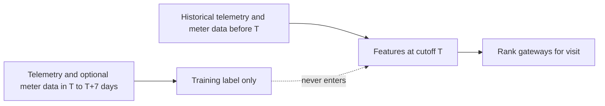

# Part 2 Machine Learning Data Audit

**Scope:** This document is the audit deliverable for Part 2. It does not train a model, change `baseline_3sigma.py`, replace `predictions.csv`, or alter the supplied data.

## 1. Executive summary

- Part 1 is protected and validated: `predictions.csv: OK`, with 120 rows, 15 ranked gateways for each of eight weeks from 2026-02-02 through 2026-03-23.
- The telemetry data contains 1,433,387 rows, 320 normalized gateway IDs, and 59 columns covering 2025-08-01 00:00 UTC through 2026-03-31 23:00 UTC.
- The telemetry grain is intended to be one gateway-hour, but it is not a clean one-row-per-gateway-hour table: 13,094 rows are in 6,547 duplicated `(gateway_id, ts_utc)` groups, and 55,117 of 68,418 gateway-days do not contain exactly 24 rows.
- The gateway population changes over time: 280 gateways are present in August and 308 in March; 268 are present in every month. Gateway IDs need colon removal and upper-casing before joins.
- `field_visits.csv` records a selected work-order process, not a random or complete fault label. Of 642 visits, 390 ended with `Kein Fehler gefunden`, 223 with `Fehler behoben`, and 29 with `Kein Zugang`.
- `meter_read_success.csv` provides a useful historical service-impact signal for 26 weeks from 2025-08-04 through 2026-01-26, but it does not cover the later scored weeks.
- The engineer workbook contains 120 statuses, exactly 60 `Schlecht` and 60 `Normal`, all reviewed on 2026-02-15 by the same reviewer. It is evidence for analysis, not a hidden answer key and not valid for earlier cutoffs.
- Recommended target: a future, seven-day **persistent telemetry degradation** label, with meter-read failure used as corroboration during historical development when available. This preserves label coverage through March and avoids making field visits or engineer review the ground truth.
- Recommended first model: an explainable regularized logistic regression ranking model, compared against the unchanged 3-sigma baseline using total cost as the primary metric.

## 2. Dataset inventory

| Dataset | Measured contents | Coverage / notes |
|---|---|---|
| `telemetry/` parquet | 1,433,387 rows; 59 columns; 320 normalized gateways | Hourly operational telemetry, 2025-08-01 to 2026-03-31; eight monthly partitions |
| `gateway_master.csv` | 332 rows, 11 columns, 332 unique master IDs | Static attributes, but 12 IDs never appear in telemetry and 12 `installed_on` dates are after the telemetry period |
| `field_visits.csv` | 642 rows, 8 columns, 247 gateways, unique visit IDs | Requested 2025-02-03 to 2026-01-30; visited 2025-02-05 to 2026-02-14 |
| `meter_read_success.csv` | 7,226 rows, 5 columns, 299 gateways | One row per `(week_start, gateway_id)`; 26 weeks, 2025-08-04 to 2026-01-26 |
| `engineer_review_2026-02.xlsx` | One sheet, 120 rows, 6 source columns | `Gateway Status`; all reviewed 2026-02-15 |

The master, visits, meter, and review files use colon-separated gateway IDs while telemetry uses the same hexadecimal IDs without colons. All joins must normalize with `upper(id).replace(':', '')`.

## 3. Actual data grain

Telemetry rows represent a timestamped gateway observation, intended to describe one gateway-hour. The data does not satisfy that invariant exactly:

- `ts_utc` has hourly-looking timestamps, but duplicated gateway/timestamp keys occur in September 2025 (4,370 rows), November 2025 (4,248 rows), and January 2026 (4,476 rows).
- There are 6,547 duplicate key groups and 13,094 affected rows when duplicates are counted with `keep=False`.
- Across all gateway-days, the row-count quantiles are 1, 16, 22, 24, and 33 at the 0th, 10th, 50th, 90th, and 100th percentiles. 55,117 of 68,418 gateway-days are not exactly 24 rows.
- Therefore, missingness and duplicates must be represented explicitly. A model must aggregate by timestamp after a documented duplicate policy, and must not silently interpret a missing row as a healthy hour.

The safest initial policy is to aggregate duplicate observations at `(gateway_id, ts_utc)` using a documented rule: sum count/duration measures only if the source semantics prove the rows are additive; otherwise use a robust representative value and retain duplicate count as a quality feature. This must be settled before training.

## 4. Data coverage and population stability

Telemetry by month:

| Month | Rows | Gateways |
|---|---:|---:|
| 2025-08 | 181,484 | 280 |
| 2025-09 | 177,308 | 280 |
| 2025-10 | 178,698 | 279 |
| 2025-11 | 172,421 | 276 |
| 2025-12 | 175,850 | 274 |
| 2026-01 | 181,470 | 288 |
| 2026-02 | 170,151 | 302 |
| 2026-03 | 196,005 | 308 |

Population changes are operationally relevant: 280 gateways start in August, 17 first appear in January, 14 in February, and 9 in March. Three gateways stop before October, two before November, three before December, and three before March; 308 are present at the end of March. Only 268 are present in all eight months.

The March 2026 partition ends on March 31, but the final weekly interval beginning March 30 contains only two days. It must not be treated as a complete week during evaluation.

## 5. Missing-data analysis

- No nulls were observed in the 59 telemetry columns.
- This does not mean telemetry is complete: absent gateway-hour rows are the primary missingness mechanism.
- `gateway_master.csv` has 180 missing `fw_updated_on` values and 320 missing `decommissioned_on` values. All 332 `installed_on` values are populated.
- `field_visits.csv` has 476 missing `parts_replaced` values; other columns are complete.
- `meter_read_success.csv` has no nulls and no zero `meters_expected` values.
- The engineer workbook has 46 missing `Bemerkung` values; its status and date fields are complete.

Missing telemetry hours should become features such as observed-hour count, missing-hour count, longest gap, and fraction observed. They must not be imputed as normal operation without an indicator.

## 6. Duplicate-data analysis

Telemetry duplicate key groups are concentrated in three partitions: September, November, and January. There are no duplicate visit IDs and no duplicate `(week_start, gateway_id)` meter rows. The master and engineer review gateway IDs are unique.

Duplicate telemetry records are the most important data-quality issue because they can change means, standard deviations, rolling sums, and the supplied 3-sigma ranking. Part 1 remains unchanged as required. Part 2 must report results under at least two duplicate policies: a conservative deduplication policy and a sensitivity run retaining duplicates.

## 7. Field visit analysis

Visits cover 247 of the 320 telemetry gateways (77.2%) and total 642 work orders. Requested dates run from 2025-02-03 to 2026-01-30; visited dates run from 2025-02-05 to 2026-02-14. The median request-to-visit delay is 9 days, with a range of 2 to 17 days.

Reported reasons are distributed across `Haeufige Neustarts` (110), `Kunde meldet Ausfall` (101), `Keine Verbindung` (100), `Auffaellige Statistik` (87), `Zaehler nicht gelesen` (86), `Signal schwach` (79), and `Routinepruefung` (79).

Outcomes are:

| Outcome | Count | Share |
|---|---:|---:|
| `Kein Fehler gefunden` | 390 | 60.75% |
| `Fehler behoben` | 223 | 34.74% |
| `Kein Zugang` | 29 | 4.52% |

### What field visits can tell us

They provide evidence of operational demand, reasons that triggered intervention, timing, and whether a technician reported a repair. They can support descriptive analysis and possibly a secondary, carefully qualified service-outcome label.

### What field visits cannot tell us

They cannot establish the prevalence of broken gateways among unvisited gateways, because visits are selected and only 247 of 320 telemetry gateways were visited. `Kein Fehler gefunden` is not proof that the gateway was healthy at the prediction cutoff, and `Fehler behoben` is not a standardized fault taxonomy. A visit is also delayed relative to the request and may reflect customer reports, routine work, or prior model/rule selection. Visit outcome must therefore not be treated as the hidden answer key.

## 8. Engineer review analysis

`engineer_review_2026-02.xlsx` has one sheet, `Gateway Status`, with 120 unique gateways: 60 `Schlecht` and 60 `Normal`. Every row has `reviewed_on = 2026-02-15` and reviewer `M. Hoffmann`; 46 comments are missing. The comments include observations such as repeated failures, suspected hardware defects, customer complaints, and stable-after-replacement notes.

This review is a contemporaneous expert snapshot, not a random sample and not the final hidden ground truth. It cannot be used for decisions before 2026-02-15. It could only be a post-review feature for a decision after that date, but its selection process and same-reviewer construction make it unsuitable as a primary model target. For the first model it should be held out for descriptive sensitivity analysis, not used as a feature or label.

## 9. Meter-read analysis

The meter file is one row per gateway-week. It contains 7,226 unique rows, 299 gateways, and 26 weekly dates from 2025-08-04 through 2026-01-26. Weekly gateway counts range from 271 to 290, with a mean of 277.9. The observed read-rate mean is 84.52%, median 90.93%, minimum 0%, and maximum 100%; 567 rows are below 50%, 1,270 below 80%, 3,239 below 90%, and 5,603 below 95%.

Historical meter behavior is a sensible service-impact feature: trailing read rate, failure count, trend, and consecutive low-rate weeks. Prediction-week meter values must not be used as features. Because the file ends on 2026-01-26, meter-based labels cannot provide a consistent observed target for the February and March scored weeks.

## 10. Candidate target definitions

### A. Future fault persistence

**Definition:** At cutoff Monday `T`, label a gateway positive when the following complete seven-day window contains persistent degradation, for example degradation on at least two distinct days and a minimum number of offline/disconnection/reboot events.

**Data required:** Future telemetry only.

**Advantages:** Available through March; directly measures persistence; does not depend on biased intervention decisions.

**Problems:** It is an operational proxy, not proof of hardware failure; thresholds need sensitivity analysis.

**Leakage risk:** Safe for training labels only when the future window is strictly after `T`; never include those rows in features.

**Operational meaning:** Prioritize gateways likely to remain degraded rather than reacting to one transient spike.

**Expected bias:** Favors detectable telemetry degradation and may miss silent meter or hardware faults.

### B. Future operational failure evidence

**Definition:** Label a gateway positive when its next weekly meter-read rate is below a predeclared threshold such as 80% or 90%.

**Data required:** Future meter-read file.

**Advantages:** Clear customer/service impact and simple evaluation.

**Problems:** Only available through 2026-01-26; read failures may be caused by upstream processes; no label for later scored weeks.

**Leakage risk:** Future meter fields are leakage if included in features for the same week.

**Operational meaning:** A gateway with substantial missed reads is a credible visit candidate.

**Expected bias:** Favors gateways with enough installed meters and the meter system's own failure modes.

### C. Future telemetry degradation plus service impact

**Definition:** Positive when persistent future telemetry degradation is accompanied by a low future meter-read rate.

**Data required:** Future telemetry and future meter reads.

**Advantages:** More specific than either signal alone and closer to a visit-worthy service problem.

**Problems:** Reduces positives, depends on meter availability, and cannot support a March evaluation with this data.

**Leakage risk:** High if future telemetry or meter data leaks into same-cutoff features.

**Operational meaning:** Strongest historical proxy for a gateway causing an observable service problem.

**Expected bias:** Misses gateways with telemetry problems but incomplete meter records.

### D. Historical composite using visits and review

**Definition:** Use `Fehler behoben`, `Schlecht`, parts replacement, or related combinations as the label.

**Data required:** Field visits and engineer review.

**Advantages:** Human operational context is available.

**Problems:** The sources are selected, delayed, inconsistent, and not complete ground truth. The review is a 120-gateway snapshot.

**Leakage risk:** Very high if outcome, parts, review status, or post-visit comments are available after cutoff.

**Operational meaning:** Represents intervention or expert concern, not necessarily latent failure.

**Expected bias:** Strong selection and ascertainment bias toward already suspected gateways.

## 11. Recommended target

Use **A, future fault persistence**, as the primary target, with **C measured as a secondary historical corroboration analysis** where meter coverage exists. A concrete first label proposal is:

> `needs_visit = 1` if, in the complete seven days after cutoff `T`, a gateway shows telemetry degradation on at least two distinct days and meets a predeclared severity rule based on offline duration, disconnections, or reboots.

The exact severity thresholds must be chosen before model fitting and tested in sensitivity runs. Because `offline_duration_sec` is zero in 77.25% of rows, has a p99 of 30,096.68, and a maximum of 726,642, persistence and robust aggregation are preferable to a single-hour maximum. Meter-read failure should be reported as corroborating evidence for historical labels, not silently required for the final target.

Alternatives B-D are rejected as the primary target because they either end before the required future weeks or encode the biased intervention process. This definition does not claim to identify every physically broken gateway; it defines a repeatable, observable reason to prioritize a visit.

## 12. Why alternatives were rejected

- **Field visit outcome:** only visited gateways receive outcomes, 60.75% of visits found no error, and visits are not a random sample.
- **Engineer `Schlecht`:** useful expert evidence but only 120 selected gateways, a single review date, and unavailable for earlier cutoffs.
- **Meter failure alone:** operationally meaningful but only 26 weeks and no coverage for the February-March scored period.
- **One-hour telemetry anomaly:** too sensitive to the duplicate/missing-row problem and transient events; it is also already represented by the benchmark's anomaly approach.

## 13. Feature candidates

All feature values must use only data strictly before cutoff `T`, after gateway ID normalization and a documented duplicate policy.

**Telemetry candidates:**

- 1, 7, 14, and 28-day aggregates of offline duration, disconnections, reboots, online minutes, message counts, and signal-quality categories.
- Counts of affected hours and affected days, longest outage, consecutive degraded hours/days, and fraction of observed hours.
- Rolling mean, median, robust spread, p90/p99, and recent-minus-history trend.
- Missing-hour count, duplicate count, and observation coverage as data-quality features.
- Ratios such as bad/normal/good RSSI or RSRP/RSRQ categories, with denominators protected against missing observations.

**Meter candidates:**

- Historical read rate, failure count, low-rate week count, trailing trend, and consecutive low-rate weeks.
- Only completed meter weeks strictly before `T`.

**Gateway master candidates:**

- Tenant, site type, region, hardware model, antenna type, firmware version, and age derived from `installed_on` only when the installation date is not after `T`.
- Firmware update recency only when the source value is known and dated before `T`.
- Do not use `decommissioned_on` as a feature for a time before that event; it is a future event for most rows.

The first model should use a small, interpretable subset and add feature families only through temporal validation. The data supports one-hot encoded categoricals and standardized numeric summaries for logistic regression.

## 14. Leakage audit

| Feature or source | Available before cutoff? | Used? | Reason / leakage risk |
|---|---|---|---|
| Historical telemetry through `T - 1 hour` | Yes | Yes | Core safe signal |
| Telemetry in the prediction week after `T` | No | No | Direct future leakage |
| Future telemetry used to make training label | No, intentionally future | Label only | Allowed for historical label construction; never a feature |
| Historical meter weeks ending before `T` | Yes | Yes | Safe service-history feature |
| Meter values for the prediction week | No | No | Direct future leakage |
| `field_visits.outcome`, `parts_replaced`, technician hours | Usually after cutoff | No | Post-intervention information and biased label |
| `field_visits.reason_reported` | Only if logged before `T` | No initially | Request timing and selection process require careful event-time reconstruction |
| Engineer review status/comments | Only after 2026-02-15 | No | Selected, post-cutoff expert evidence; not a general feature |
| `decommissioned_on` | Only on/after event | No initially | Future lifecycle event leaks availability |
| `installed_on` | Usually safe if date <= `T` | Yes with cutoff check | Twelve master dates are after telemetry end and must be excluded until their dates |
| `fw_updated_on` | Safe only when date <= `T` | Yes with cutoff check | 180 values are missing; never backfill from later information |
| Same-window target aggregates | No | No | Target-derived leakage |
| Gateway ID itself | Yes but not causal | No as numeric feature | Memorization harms unseen-gateway testing |

## 15. Feature exclusions

Exclude future-week telemetry and meter values, review fields, post-visit outcome/repair fields, target-derived aggregates, future decommission dates, and raw gateway IDs. Also exclude incomplete March 30 week from evaluation. Any use of field visit request information must be event-time filtered and treated as a separate experiment because requests are part of the intervention-selection process.

## 16. Training-label construction

Use weekly Monday cutoffs. For a cutoff `T`:

- **Feature window:** historical telemetry from `T - 28 days` through the last complete hour before `T`; historical meter weeks whose week ends before `T`; cutoff-valid master attributes.
- **Label window:** the complete seven calendar days `[T, T + 7 days)`.
- **Prediction cutoff:** predictions are generated at `T`; no row with timestamp `>= T` may enter features.

The first reproducible training-label window with a 28-day feature history and meter support is approximately September 2025 through the cutoff of 2026-01-19, whose next meter week begins 2026-01-26. Telemetry-only labels can extend later, but should not be mixed with the composite target without clearly separating experiments.

## 17. Temporal split proposal

Do not randomly split hourly rows. Build one row per `(cutoff_week, gateway)` and split by both time and gateway:

- **Training:** earlier complete cutoff weeks, for example September through December 2025, using only the training gateway set.
- **Validation:** later complete weeks, for example January 2026, using later time and preferably a gateway set disjoint from training for a strict generalization slice.
- **Test:** February and March 2026 complete weeks, including gateways not present in training. March 30 is excluded because it is only two days.

The exact dates should be selected after counting eligible gateway-week rows and ensuring every row has a full 28-day feature window and a complete seven-day label window. A second rolling-origin validation should repeat the comparison at multiple cutoffs.

## 18. Unseen-gateway test proposal

Define each gateway's first telemetry month. Hold out a gateway-disjoint subset made of gateways first appearing in January-March 2026, subject to enough pre-cutoff history. For a clean cold-start test, train on gateways present before January 2026 and evaluate on gateways first appearing in January or later. Report how many gateways and gateway-weeks are eligible; do not silently fill missing histories. Static master attributes may be used only for these gateways if their values were available by the cutoff.

This tests whether the model learned operational patterns rather than memorizing gateway IDs. Because only 40 gateways first appear from January through March, the unseen-gateway result will have wider uncertainty and should be reported with a spread.

## 19. Baseline cost evaluation method

For each complete scored week, select at most 15 gateways. Compare the ML ranking and unchanged 3-sigma ranking against the same realized target:

`total_cost = 380 * unnecessary_visits + 600 * missed_broken_gateways_per_week`

An unnecessary visit is a selected gateway with `needs_visit = 0`; a missed broken gateway is an unselected gateway with `needs_visit = 1`, charged once per evaluation week. Report total cost, cost per week, selected count, precision@15, recall, and the number of positive gateways. Also report bootstrap or week-level ranges, especially for the unseen-gateway slice.

The supplied repository contains no hidden final ground truth, so this audit cannot honestly calculate an ML-versus-baseline cost result. The validator only verifies output format and coverage. The first implementation must compute both rankings on identical labels and declare ML better only if its measured total cost is lower on forward and device-disjoint evaluation.

## 20. Model recommendation

Start with regularized logistic regression used as a ranking model, not as a fixed classification threshold. Reasons:

- It is computationally light and easy to modify live.
- Standardized numeric features and one-hot categorical features remain inspectable.
- Coefficients and score changes provide an understandable explanation of what the model attends to.
- It handles a small number of weekly gateway examples better than an unnecessarily complex learner.
- It can output a score for ranking the fixed 15-visit budget.

Weaknesses are linear effects, sensitivity to correlated rolling features, and dependence on target quality. A tree-based challenger can be added only after the baseline feature set and split are working, and only if it improves forward total cost rather than just accuracy or ROC-AUC.

## 21. Risks

- Duplicate and missing telemetry rows can distort aggregates and the official benchmark comparison.
- Field visits are selected interventions, not random labels.
- The meter file stops before the later scored weeks.
- Gateway population churn creates cold-start and covariate-shift risk.
- Master dates include future installation dates relative to the telemetry period.
- The proposed target is an observable operational proxy, not definitive hardware truth.
- Positive prevalence and cost estimates may be unstable across weeks; report ranges.

## 22. Limitations

There is no confirmed hidden ground-truth file in the workspace. The audit therefore defines a defensible training target and evaluation protocol but does not claim predictive performance. The first label threshold is still a design choice and requires sensitivity analysis. The 120-row engineer review and historical field visits cannot validate all gateways.

## 23. What another week or two would buy

One week would support the duplicate-policy implementation, cutoff-safe feature table, and a baseline-versus-logistic-regression replay on the historical telemetry-label period. Two weeks would allow rolling-origin and unseen-gateway evaluation, threshold sensitivity, cost ranges, and a targeted review of disagreements with field visits and engineer status. Additional confirmed outcomes or hidden evaluation feedback would buy more than hyperparameter tuning because target validity is the main uncertainty.

## 24. Exact next implementation steps

1. Normalize gateway IDs and create an event-time-safe, one-row-per-gateway-week modeling table.
2. Resolve and document duplicate timestamp aggregation; retain row-quality counts.
3. Implement the proposed future-persistence label with thresholds fixed before fitting, plus a meter-corroborated sensitivity label where available.
4. Generate only cutoff-safe 7/14/28-day telemetry and historical meter features.
5. Create chronological, device-disjoint train/validation/test manifests and exclude incomplete weeks.
6. Implement the shared cost evaluator and run the unchanged 3-sigma baseline on the same realized labels.
7. Fit the interpretable logistic ranking model, report coefficients and score ranges, and stop if forward total cost does not improve.
8. Present the results for review before changing any Part 1 file or producing a new submission.

**Audit status:** complete. Final ML training and prediction generation intentionally not performed.